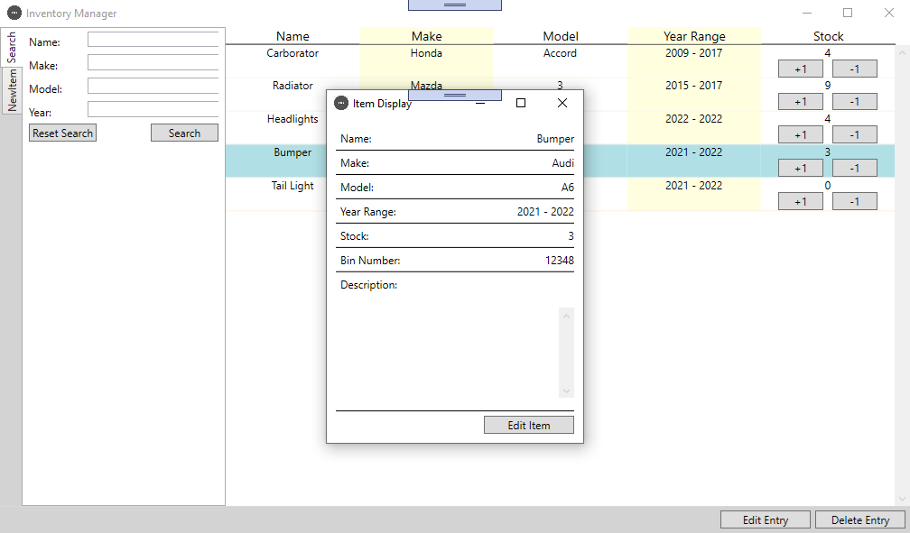

<!--
*** Thanks for checking out the Best-README-Template. If you have a suggestion
*** that would make this better, please fork the repo and create a pull request
*** or simply open an issue with the tag "enhancement".
*** Thanks again! Now go create something AMAZING! :D
-->

<!-- PROJECT SHIELDS -->
<!--
*** I'm using markdown "reference style" links for readability.
*** Reference links are enclosed in brackets [ ] instead of parentheses ( ).
*** See the bottom of this document for the declaration of the reference variables
*** for contributors-url, forks-url, etc. This is an optional, concise syntax you may use.
*** https://www.markdownguide.org/basic-syntax/#reference-style-links
-->

<!-- PROJECT LOGO -->
 

  

  <h3 align="center">Inventory Manager</h3>

  

    An inventory management program for managing stock of a automotive parts store.
     
    <a href="https://github.com/blakemardon/InventoryManager"><strong>Explore the docs »</strong></a>
  

<!-- TABLE OF CONTENTS -->

  
Table of Contents

  <ol>
    <li>
      <a href="#about-the-project">About The Project</a>
      <ul>
        <li><a href="#built-with">Built With</a></li>
      </ul>
    </li>
    <li><a href="#getting-started">Getting Started</a></li>
    <li><a href="#usage">Usage</a></li>
    <li><a href="#license">License</a></li>
    <li><a href="#contact">Contact</a></li>
  </ol>

<!-- ABOUT THE PROJECT -->
## About The Project

This project is intended to be able to maintain a list of all parts availible in inventory for a automotive parts store. This project was an initial version to show competency in creating a system that is easy to use. Future versions would include moving from a XML file for storing data to a database as well as add features based on what is needed for the software to increase usability.

### Built With

* [WPF](https://docs.microsoft.com/en-us/visualstudio/designers/getting-started-with-wpf?view=vs-2019)

<!-- GETTING STARTED -->
## Getting Started

The project was originally written in Visual Studio 2013. All subsequent versions should have no problem compileing and running the code on windows machines.

<!-- USAGE EXAMPLES -->
## Usage

Items can be added to the program using the new itme tab on the far left. Items can also be searched for using the search tab. Modifying an item can be done by clicking on the row in the software. The item will highlight and then can now be edited using the edit or delete buttons at the bottom.

<!-- LICENSE -->
## License

Distributed under the MIT License.

<!-- CONTACT -->
## Contact

BlakeMardon - BlakeMardon@gmail.com

Project Link: [https://github.com/blakemardon/InventoryManager](https://github.com/blakemardon/InventoryManager)

